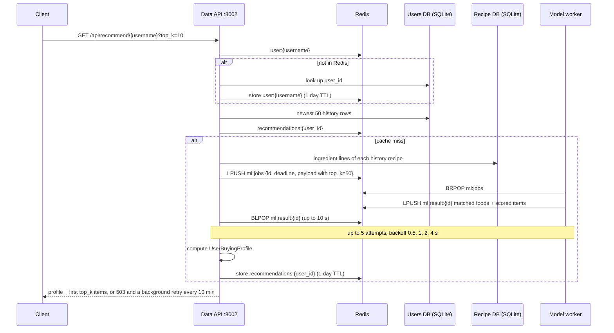

# Recommendations: model and API

Remymy recommends grocery foods to a user based on the recipes they have
cooked and rated. The foods come from a catalog of 10,845 USDA FoodData Central
(FDC) foods priced from FairPrice, in SGD. A trained reranker scores how likely
the user is to like each food, and the API also returns a *buying profile*: the
average price and nutrients of the foods the user's recipes call for.

Three pieces are involved:

| Component | Code | Port | Role |
| --- | --- | --- | --- |
| Data API | [`api/`](api/) | 8002 | Users, history, recipes, the public recommendation endpoint, caching |
| Model service | [`ml_models/`](ml_models/) | 8003 | Queue worker for ingredient matching, retrieval and reranking |
| Redis | `redis` in [`docker-compose.yml`](docker-compose.yml) | 6379 (internal) | Job queue between the two, and cache for user ids and recommendations |



---

## The model

### What it predicts

The model is a **GRU + cross-attention reranker**. Given a user's dated, rated
history and a candidate item, it outputs **P(like)**: the probability that the
user would rate the candidate 3 to 5 stars. It only scores candidates. Choosing
them is the retrieval step described under
[How the model service uses it](#how-the-model-service-uses-it).

The design spec is `recipe_reranker_spec.md` in the ML development folder. The
training notebook is
[`DataMappingRecommendation/model_training_reranker_avgemb.ipynb`](../../DataMappingRecommendation/model_training_reranker_avgemb.ipynb).

### Inputs

Every item, whether a history item or a candidate, is described by two things:

- **Text:** the ingredient phrases of the item, split by an NER step into
  `product`, `adj` and `verb` fields (for example "winter squash" is a product,
  "fresh" an adjective, "chopped" a verb). Words are lowercased, lemmatized with
  the field's part of speech, singularized and de-duplicated, up to 40 tokens.
  The vocabulary has 1,906 tokens.
- **Numbers:** `log1p` of `[price, calories, total fat, sugar, sodium, protein,
  saturated fat, carbohydrates]`, z-scored with training statistics.

The user is described by:

- **Profile:** the mean of those eight `log1p` numbers over the whole history,
  z-scored.
- **History windows:** the history in date order, cut into windows wherever two
  ratings are 183 days (about six months) or more apart, so each window is one
  period of the user's taste. The last 10 windows are kept, with the last 20
  items in each. Each item carries its rating, centered on the user's mean
  rating. A missing rating counts as the mean.

### Architecture

```
item tokens + [price, nutrients] ──► ItemEncoder ──► item_emb (64)

history item_emb + centered ratings, per window ──► GRU (restarted per window)
                                                     ──► one state per window

mean [price, nutrients] of the history ──► UserEncoder (MLP) ──► profile token

candidate item_emb ──► cross-attention over [profile token; window states]
                   ──► MLP(concat(attention output, candidate item_emb))
                   ──► logit ──► sigmoid ──► P(like)
```

- **ItemEncoder:** token and field embeddings, one self-attention layer
  (no positional encoding, since ingredient order carries no meaning), mean
  pooling, a linear projection of the eight numbers, then a linear fusion to 64
  dimensions.
- **UserEncoder:** Linear → ReLU → Linear from the 8 profile numbers to 64.
- **History encoder:** each window's step input is `item_emb +
  Linear(centered rating)`. The GRU starts from zero in every window, and each
  window's final hidden state is its state.
- **Reranker:** the candidate attends (4 heads) over the profile token and the
  window states. Learned embeddings mark which key is the profile and how recent
  each window is.

| Setting | Value |
| --- | --- |
| Embedding size `d` | 64 |
| Attention heads | 4 |
| Text self-attention layers | 1 |
| Max tokens per item | 40 |
| Windows × items per window | 10 × 20 |
| Window gap | 183 days |
| Dropout | 0.1 |

### Training

- **Data:** Food.com ratings joined to Food.com recipes, whose ingredients were
  priced from FairPrice by
  [`DataMappingRecommendation/map_recipe_nutrients.ipynb`](../../DataMappingRecommendation/map_recipe_nutrients.ipynb).
  Recipe totals range from 3.08 to 426 SGD.
- **Labels:** ratings 3 to 5 are positive, 0 to 2 negative. A Food.com rating
  of 0 means a review without stars and counts as negative.
- **Users:** only users with at least 6 ratings are kept: 10,450 users and
  356,422 ratings, 96.4% of them positive.
- **Negatives:** each positive is paired with one recipe the user never rated,
  drawn in proportion to popularity so that popularity alone cannot separate the
  classes.
- **Split:** per user, the last rating is test, the second-to-last validation,
  the rest training.
- **No leakage:** a target on day *t* only sees ratings from days strictly
  before *t*, for its history, its profile and its rating centering.
- **Optimization:** AdamW, learning rate 1e-3, weight decay 1e-5, batch size
  512, binary cross-entropy, early stopping on validation log loss. The best
  epoch was 5 of at most 10.

Artifacts in [`DataMappingRecommendation/model_artifacts/gru_xattn_reranker/`](../../DataMappingRecommendation/model_artifacts/gru_xattn_reranker/):

| File | Contents |
| --- | --- |
| `model.pt` | Trained weights |
| `config.json` | Hyperparameters, vocabulary, normalization statistics, test metrics |
| `item_cache.pt` | Embeddings of the 99,763 training recipes (not used when serving) |
| `training_history.csv` | Loss and AUC per epoch |

### Test results

Classification, over all test rows:

| Metric | Value |
| --- | --- |
| ROC-AUC | 0.625 |
| AUC, positives vs sampled negatives | 0.634 |
| AUC, positives vs rated negatives | 0.514 |
| Log loss | 0.667 |
| Accuracy / precision / recall / F1 | 0.587 / 0.571 / 0.555 / 0.563 |

Ranking, where each held-out positive is ranked among 99 recipes the user never
rated:

| Metric | Value |
| --- | --- |
| HR@10 | 0.197 |
| NDCG@10 | 0.092 |
| MRR | 0.086 |
| Mean rank | 38.0 of 100 |

HR@10 of 0.197 is about twice what random ordering gives (0.10). The spec
reports a popularity baseline of about 0.14 under the same negative sampling.
The AUC against rated negatives, 0.514, is close to chance: the model tells
recipes a user engages with apart from random ones, but hardly separates recipes
the user liked from recipes they rated and disliked.

### How the model service uses it

[`ml_models/serve.py`](ml_models/serve.py) wraps the pipeline in
[`DataMappingRecommendation/model_inference_score_recommend.py`](../../DataMappingRecommendation/model_inference_score_recommend.py).
The inference code, weights and catalog are not copied into `ml_models/`; the
model service loads them from `DataMappingRecommendation/`, locally and when
the Docker image is built.

At startup it:

1. Loads the catalog, `price_mapped_nutrients.csv`: 10,845 FDC foods, each
   with a price (the sum of its FairPrice item prices, in SGD) and nutrients per
   100 g. Missing nutrients take the catalog median.
2. Embeds every catalog food with the ItemEncoder and builds an HNSW index with
   cosine distance (M 16, ef 200). The index is saved under `INDEX_DIR` and
   reused while the model and catalog files are unchanged.
3. Builds the ingredient index. Each catalog food gets a key: the first
   comma-separated part of its FDC description, normalized (lowercase,
   parentheses and punctuation removed, stop words dropped, singularized), so
   "Waffles, buttermilk, frozen" becomes `waffle`. For each key it keeps one
   fully priced food, the one whose price is closest to the median price of that
   key's foods. This gives 1,377 keys. The method is the exact-match step of
   `map_recipe_nutrients.ipynb`.
4. Starts the queue worker (see [The job queue](#the-job-queue)).

For each job it:

1. Normalizes each ingredient line the same way and looks it up in the
   ingredient index. Each food counts once per history entry, in order.
2. Turns every matched food into a history item with its entry's rating and date.
3. Averages the history items' normalized embeddings into one query vector and
   retrieves the 100 nearest catalog foods, excluding the history itself.
4. Drops candidates with cosine similarity 0.97 or more to any history food,
   since the catalog holds many near-identical foods.
5. Scores the rest with the reranker.
6. Picks `top_k` by maximal marginal relevance, with weight 0.5 on P(like) and
   0.5 on diversity. It never picks two foods with cosine similarity 0.97 or
   more, so it can return fewer than `top_k`.

### Limitations

- **Recipes in training, single foods in serving.** The model was trained on
  whole Food.com recipes, but it retrieves and scores single catalog foods.
  Their numbers are on different scales: nutrients per 100 g instead of per
  serving, and one item's price instead of a recipe's total. Treat the scores
  as a ranking signal rather than calibrated probabilities.
- **Near-chance on liked vs disliked** (AUC 0.514 against rated negatives).
- **Low ingredient match coverage.** Matching is exact, and the recipe ingester
  leaves quantity fragments in ingredient names (for example ". kosher salt").
  On the local recipe database, 6 of the demo user's 82 ingredient lines match a
  priced food, and more than half of 500 random recipes match none. A user with
  no matched food gets no profile and no recommendations.
- **Arbitrary stand-in foods.** The median-price food stands for its whole key,
  so "tomatoes" maps to "Tomatoes, sun-dried" (258 kcal per 100 g), which skews
  the nutrient averages.

---

## The API

### Running it

- **Docker:** `docker compose up --build` from this
  directory starts everything, including Redis and the model service. The model
  service is healthy about 25 seconds after start.
- **Locally:** create one virtual environment for both services:

  ```bash
  python3.12 -m venv api/.venv
  api/.venv/bin/pip install -r api/requirements.txt -r ml_models/requirements-serve.txt
  ```

  Start Redis on `localhost:6379` (for example `redis-server`); both services
  need it. Then `./run-local.sh` starts the model service, waits for it to
  become healthy, then starts the Data API, with both logs in one terminal.
  Ctrl+C stops both. Alternatively, run `python3 serve.py` in `ml_models/` and
  then in `api/`. The API's `serve.py` fills in localhost defaults (see
  [Configuration](#configuration)).
- **Swagger:** http://localhost:8002/docs for the Data API and
  http://localhost:8003/docs for the model service. `/` on either redirects to
  `/docs`.
- **Demo user:** with `SEED_DEMO_USER=true` (the default in compose and in
  `serve.py`), the API creates a `demo` user at startup if it does not exist.
  Its history is the first recipe whose title contains each of chicken, tomato,
  salad, soup and chocolate, rated 5, 4, 5, 3 and 2. In Swagger,
  `GET /api/recommend/{username}` comes pre-filled with `demo`.

### Data API endpoints (port 8002)

| Method | Path | Parameters | Returns |
| --- | --- | --- | --- |
| GET | `/health` | none | `{"status": "ok"}` while the process is up |
| GET | `/ready` | none | `{"status": "ok"}` once the recipe database is usable, otherwise 503 |
| GET | `/api/recipes` | `q` (optional, max 200 characters), `limit` 1–100 (default 20), `offset` ≥ 0 | Paged recipe summaries. `q` searches titles and ingredient lines, case-insensitive |
| GET | `/api/recipes/{recipe_id}` | none | Title, ingredient lines, instruction steps; 404 if unknown |
| GET | `/api/recommend/{username}` | `top_k` 1–50 (default 10) | Buying profile and recommended foods |

#### `GET /api/recommend/{username}`

```bash
curl "http://localhost:8002/api/recommend/demo?top_k=3"
```

For the demo user on the local recipe database, rounded:

```json
{
  "profile": {
    "user_id": 1,
    "avg_price": 7.66,
    "avg_nutrient_values": {
      "carb_g": 18.83,
      "cholesterol_mg": 0.0,
      "energy_kcal": 224.17,
      "fat_g": 16.72,
      "fiber_g": 0.53,
      "protein_g": 0.31,
      "satfat_g": 2.6,
      "sodium_mg": 13.33,
      "sugars_g": 17.29
    }
  },
  "items": [
    {"id": "169287", "title": "Spinach, frozen, chopped or leaf, unprepared (Includes foods for USDA's Food Distribution Program)", "score": 0.644},
    {"id": "170007", "title": "Onions, welsh, raw", "score": 0.626},
    {"id": "175206", "title": "Chickpeas (garbanzo beans, bengal gram), mature seeds, canned, solids and liquids", "score": 0.621}
  ]
}
```

That profile rests on the 6 foods matched from the demo user's 82 ingredient
lines (see [Limitations](#limitations)).

- **`profile`:** averages over every catalog food matched from the user's
  history, counting a food once per history entry. `avg_price` is in SGD, and
  nutrients are per 100 g. Only nutrients the matched foods have are listed.
  It is `null` when no ingredient in the history matched a priced food.
- **`items`:** catalog foods, not recipes. `id` is the FDC id, `title` the FDC
  description, and `score` the model's P(like), highest first.
- **Unknown user, or no history:** `{"profile": null, "items": []}` with status
  200.
- **Errors:**
  - 503 `Recommendations are unavailable right now; they will be retried in the
    background.` with `Retry-After: 600` when five attempts through the queue
    fail (see [The job queue](#the-job-queue)). A later request is answered from
    the cache once the background retry has succeeded.
  - 502 `The recommendation model rejected the request.` when the worker finds
    the job invalid. This is not retried.
  - 503 `Recipe data is unavailable.` when the recipe database is missing.
  - 422 when `top_k` is out of range.

### Model service endpoints (port 8003)

The Data API reaches the model through the Redis queue, not over HTTP. The
HTTP endpoints stay for the compose health check and for trying the model
directly in Swagger; `POST /v1/recommend` runs the same code as a queue job.

| Method | Path | Returns |
| --- | --- | --- |
| GET | `/health` | `{"status": "ok", "catalog_items": 10845, "ingredient_keys": 1377}` once the index is built |
| POST | `/v1/recommend` | Matched foods per history entry, and scored recommendations |

#### `POST /v1/recommend`

| Field | Type | Limits |
| --- | --- | --- |
| `history` | list of `{rating, date, ingredients}` | 1–500 entries |
| `history[].rating` | number or `null` | `null` counts as the user's mean |
| `history[].date` | `YYYY-MM-DD` | Orders the history and cuts the windows |
| `history[].ingredients` | list of ingredient lines | up to 500 |
| `top_k` | integer | 1–50, default 10 |
| `candidates` | integer | 1–1000, default 100 foods retrieved before reranking |

```json
{
  "history": [
    {"rating": 5, "date": "2026-09-01", "ingredients": ["chicken breast", "tomatoes", "salt", "butter"]},
    {"rating": 2, "date": "2026-09-10", "ingredients": ["apples", "butter"]}
  ],
  "top_k": 5
}
```

The response has one list of matched foods per history entry, in request order,
and the scored items in MMR pick order. For the body above, with only the first
food of each entry, three nutrients per food and the first item shown:

```json
{
  "ingredients": [
    [
      {"fdc_id": 172962, "name": "Chicken breast, fat-free, mesquite flavor, sliced", "price": 4.95,
       "nutrient_values": {"energy_kcal": 80.0, "protein_g": 16.8, "fat_g": 0.39}}
    ],
    [
      {"fdc_id": 167793, "name": "Apples, raw, fuji, with skin (Includes foods for USDA's Food Distribution Program)",
       "price": 5.9, "nutrient_values": {"energy_kcal": 63.0, "protein_g": 0.2, "fat_g": 0.18}}
    ]
  ],
  "items": [
    {"fdc_id": 2709611, "name": "Mustard greens, frozen, cooked, fat added", "price": 2.12,
     "p_like": 0.710, "similarity": 0.886}
  ]
}
```

In full, the first entry matches four foods (chicken breast, "Tomatoes,
sun-dried", "Salt, table" and "Butter, Clarified butter (ghee)") and the second
matches apples and the same butter.

`similarity` is the cosine similarity between the food and the user's query
vector. When no ingredient matches, `items` is empty.

### How a recommendation request is served

1. **Find the user id.** Look up `user:{username}` in Redis. If it is missing,
   query `app_user` in the users database and store the id in Redis for
   `CACHE_TTL_SECONDS` (default 86400, one day). New users are written to
   Redis when they are created. Unknown usernames are not cached.
2. **Load the history:** the user's newest 50 `user_history` rows.
3. **Check the cache** at `recommendations:{user_id}`. On a hit, return it,
   trimmed to `top_k`.
4. **On a miss:**
   1. Read the ingredient lines of each history recipe from the recipe database.
   2. Submit one model job through the queue with `top_k=50`, retrying as
      described below.
   3. Compute the `UserBuyingProfile` from the matched foods it returns.
   4. Store the result in Redis for `CACHE_TTL_SECONDS` (default 86400, one
      day), then return it trimmed to `top_k`.

Because the API always asks for 50 items, one cache entry serves any `top_k`.
A user's new history only affects their recommendations once the cached entry
expires. If Redis is down, user lookups fall back to the users database, but
recommendations fail with 503 because the queue lives in Redis too.

### The job queue

The code is in [`api/src/remymy_api/jobs.py`](api/src/remymy_api/jobs.py) and
the worker in [`ml_models/serve.py`](ml_models/serve.py).

- **Submit.** The API pushes `{"id", "deadline", "payload"}` onto the list
  `ml:jobs` (`LPUSH`), where `payload` is the `POST /v1/recommend` body and
  `deadline` is now plus `ML_QUEUE_TIMEOUT_SECONDS`. It then waits on
  `ml:result:{id}` with `BLPOP` for up to that many seconds.
- **Work.** The model service runs one worker thread that takes jobs with
  `BRPOP`, so jobs are served first in, first out. It drops jobs past their
  deadline without running the model, since nobody is waiting for them any
  more. It replies on `ml:result:{id}` (kept 60 s) with `{"result": ...}`, or
  `{"error": ..., "retryable": true|false}`. A payload that fails validation is
  not retryable; any other exception is. To add throughput, run more model
  service replicas against the same Redis.
- **Retry with backoff.** A timeout, a Redis error, an unreadable reply or a
  retryable error counts as a failed attempt. The API makes up to 5 attempts,
  each with a new job id, and waits 0.5, 1, 2 and 4 seconds between them. With
  the default 10-second timeout, a request that fails every attempt returns
  after about 57 seconds.
- **Background retry.** After the fifth failure, the API answers 503 and hands
  the user to a background thread. Every 10 minutes the thread repeats the
  whole cycle (5 attempts with backoff) and writes the result to the cache. It
  stops only once the cache write succeeds, or when the API shuts down. There
  is at most one such thread per user id in each API process, so repeated
  requests do not start more. The retry uses the history as it was when the
  request failed.

### Data model

API schemas, in [`api/src/remymy_api/schemas.py`](api/src/remymy_api/schemas.py):

| Schema | Fields |
| --- | --- |
| `Preferences` | `special_diet` (`vegetarian`, `halal`, `Hinduism` or `null`), `cuisines` (up to 40), `preferred_nutrient` (up to 64 characters). Unknown keys are rejected |
| `User` | `id`, `username`, `preferences` |
| `UserHistory` | `user_id`, `timestamp`, `rating` (0–5 or `null`), `recipe_id` |
| `Ingredient` | `fdc_id`, `name`, `price`, `nutrient_values` |
| `UserBuyingProfile` | `user_id`, `avg_price`, `avg_nutrient_values` |
| `RecommendedRecipe` | `id`, `title`, `score` |
| `RecommendationResponse` | `profile` (`UserBuyingProfile` or `null`), `items` (list of `RecommendedRecipe`) |

Storage:

| Store | Location | Contents |
| --- | --- | --- |
| Recipe database | `data/remymy-food.db`, mounted read-only | `recipe`, `recipe_ingredient`, `recipe_instruction`, plus FDC Foundation Foods tables. Built by `api/migrations/bootstrap.py` and replaced on rebuild |
| Users database | `USER_DATABASE_PATH`, the `remymy-user-data` volume in compose | `app_user` (`user_id`, unique `username`, `preferences` as SQLite JSONB, `created_at`) and `user_history` (`user_id` → `app_user`, `timestamp`, `rating` 0–5 or `null`, `recipe_id`) |
| Redis | `redis` service, 256 MB, least-recently-used eviction | `user:{username}` → user id; `recommendations:{user_id}` → cached response JSON; `ml:jobs` → pending model jobs; `ml:result:{id}` → one job's reply |
| Catalog | `DataMappingRecommendation/input_stage2/price_mapped_nutrients.csv` | The priced FDC foods, read by the model service |

The users database enforces the preference rules itself: a `CHECK` constraint
holds `preferences` to exactly the three keys and their allowed values, and a
trigger rejects non-string cuisines. `user_history.recipe_id` points at
`recipe.recipe_id` in the recipe database. SQLite cannot enforce a foreign key
across files, so `add_history` checks it in code.

### Configuration

Data API:

| Variable | Docker default | `api/serve.py` default | Purpose |
| --- | --- | --- | --- |
| `DATABASE_PATH` | `/data/remymy-food.db` | `../data/remymy-food.db` | Recipe database |
| `USER_DATABASE_PATH` | `/state/remymy-users.db` | `./remymy-users.db` | Users database, created on startup |
| `REDIS_URL` | `redis://redis:6379/0` | `redis://localhost:6379/0` | Cache and job queue |
| `ML_QUEUE_TIMEOUT_SECONDS` | `10` | `10` | How long one attempt waits for the worker's reply |
| `CACHE_TTL_SECONDS` | `86400` | `86400` | Lifetime of cached user ids and recommendations (one day) |
| `SEED_DEMO_USER` | `true` in compose | `true` | Create the `demo` user at startup |
| `HOST`, `PORT` | `0.0.0.0`, `8002` | `127.0.0.1`, `8002` | Listen address |

Model service:

| Variable | Docker default | Local default | Purpose |
| --- | --- | --- | --- |
| `CATALOG_PATH` | `/catalog/price_mapped_nutrients.csv`, mounted from `CATALOG_FILE` | `DataMappingRecommendation/input_stage2/price_mapped_nutrients.csv` | Priced FDC catalog |
| `ARTIFACT_DIR` | `/opt/remymy-ml/weights/gru_xattn_reranker` | `DataMappingRecommendation/model_artifacts/gru_xattn_reranker` | Model weights and config |
| `INFERENCE_DIR` | `/opt/remymy-ml/inference` | `DataMappingRecommendation` | Where the inference modules are imported from |
| `INDEX_DIR` | `/var/cache/remymy/retrieval-index` | system temp folder | Where the HNSW index is saved |
| `REDIS_URL` | `redis://redis:6379/0` | `redis://localhost:6379/0` | Job queue |
| `HOST`, `PORT` | `0.0.0.0`, `8003` | same | Listen address |

### Building the recipe database

`api/migrations/bootstrap.py` builds `data/remymy-food.db` from two sources:

- **`--recipes`:** the 13k Open Recipes dataset, as a `.csv` with `id`,
  `title`, `ingredients` and `instructions` columns, or as a `.db` with a
  `recipes` table of the same columns.
- **`--fdc-dir`:** a FoodData Central **Foundation Foods** CSV export. The full
  FDC export also works in principle, but its roughly 27 million nutrient rows
  make the build take hours and produce a database tens of GB in size.

In Docker, `api-migrate` runs this once, using `RECIPES_SOURCE` and
`FDC_SOURCE_DIR`, and leaves an existing valid database unchanged.

### Tests

```bash
cd api
PYTHONPATH=src python -m pytest

cd ../ml_models
python -m pytest tests
```

The API suite uses a fake Redis and a fake queue, and the model service suite
tests the worker with a fake Redis and a stubbed model, so neither needs Redis
running.
